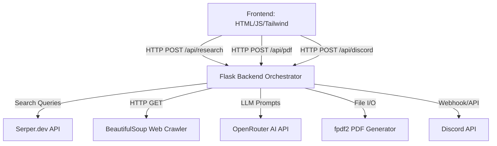

# Comprehensive Project Documentation
**Project Name:** AI-Powered Company Research Assistant
**Author:** Manish Giri

---

## 1. Introduction
The **AI-Powered Company Research Assistant** is an intelligent web application designed to automate business research. It empowers users to input either a company name or a website URL and receive a highly detailed, AI-generated report containing the company's contact information, products/services, pain points, and a list of direct competitors. 

## 2. Project Overview
The application follows a classic client-server architecture to automate the process of gathering, analyzing, and synthesizing information about any company. Users can input a company name or a direct URL, and the application will search the web, scrape the relevant website pages, use AI to analyze the data, and produce a professional PDF report containing company details, products, pain points, and competitor analysis.

## 3. Tasks Achieved
- [x] **Project Scaffold & Initialization:** Environment setup using Python and Flask.
- [x] **Search Integration:** Utilized `Serper.dev` to find official company websites from text inputs.
- [x] **Web Crawling Engine:** Built a custom `BeautifulSoup4` scraper to intelligently extract text from target websites while ignoring boilerplate HTML.
- [x] **AI Synthesis:** Integrated `OpenRouter` to process scraped text and generate structured JSON insights dynamically.
- [x] **PDF Generation:** Implemented on-the-fly PDF creation using `fpdf2`.
- [x] **Discord Webhook:** Added the ability to push messages and PDF files directly to Discord.
- [x] **Frontend UI/UX:** Built a responsive, animated chat UI using HTML, Vanilla JS, and Tailwind CSS.

## 4. High-Level Architecture
The application follows a classic client-server architecture:
- **Frontend (Client):** A responsive, single-page application built with Vanilla HTML, CSS (Tailwind), and JavaScript. It communicates with the backend via RESTful APIs.
- **Backend (Server):** A Python-based Flask application that acts as the orchestrator. It handles API requests, interacts with third-party APIs (Serper, OpenRouter, Discord), performs web scraping, and generates PDF files.

### 4.1 Component Diagram


## 5. Technology Stack

### Frontend
- **HTML5:** Semantic structuring of the web application.
- **Tailwind CSS (via CDN):** Rapid UI styling, responsive design, and dark mode aesthetics.
- **Vanilla JavaScript:** DOM manipulation, state handling, and asynchronous API calls (`fetch`).
- **FontAwesome:** Scalable vector icons (e.g., lightbulb, robot, Discord logo).

### Backend
- **Python 3.10+:** The core programming language.
- **Flask:** Lightweight web framework used for routing and API endpoint creation.
- **BeautifulSoup4 & Requests:** Used to scrape HTML content from target websites and extract meaningful text.
- **fpdf2:** A library for dynamically generating formatted PDF reports.
- **python-dotenv:** For securely managing environment variables and API keys.
- **Gunicorn:** WSGI HTTP Server for UNIX, used for production deployment.

### External APIs
- **Serper.dev:** Used as a Google Search proxy to find official company websites based on a name query, and to fall back on search snippets if website crawling fails.
- **OpenRouter (LLMs):** A unified AI API that allows dynamic switching between models (GPT-4o, Claude 3.5 Sonnet, Llama 3) to analyze scraped text and generate structured JSON insights.
- **Discord API:** Used to push notifications and upload the generated PDF reports directly to a specified Discord channel using a Bot Token.

## 6. Execution Workflow (How it Works)
1. **Input Handling:** The user provides either a "Company Name" or "URL" on the frontend.
2. **Website Resolution (Serper):** If a name is provided instead of a valid URL, the Flask backend queries Serper.dev for `"{Company Name} official website"` to retrieve the highest-ranking official URL.
3. **Web Crawling:** The backend uses the `requests` library to fetch the HTML of the website. It parses the DOM using `BeautifulSoup`, stripping out scripts, styles, and navigation elements to extract only meaningful text content. It may also discover and crawl secondary pages (like `/about` or `/products`).
4. **AI Analysis (OpenRouter):** The extracted raw text (truncated to fit LLM context limits) is sent to OpenRouter via a strict system prompt. The LLM is instructed to extract the company name, phone, address, services, pain points, and competitors, and return them strictly as a JSON object.
5. **Report Generation (Frontend & PDF):** 
   - The JSON data is sent back to the frontend to be displayed beautifully in the chat interface.
   - When the user clicks "Download PDF", a request is sent to the `/api/pdf` endpoint. The backend uses `fpdf2` to construct a multi-page PDF document on the fly.
6. **Discord Integration:** If configured, immediately after the PDF is generated, the backend uses the Discord Bot API to upload the PDF file and send a formatted message containing the applicant's details and company info.

## 7. Functional Requirements
1. **Input Flexibility:** Must accept both company names (e.g., "Microsoft") and URLs (e.g., "https://microsoft.com").
2. **Search Capabilities:** Must use Serper.dev for finding official URLs and gathering supplementary context.
3. **Web Crawling:** Must extract meaningful textual content from the target company's web pages.
4. **AI Processing:** Must utilize OpenRouter to allow dynamic AI model selection (e.g., GPT-4o, Claude 3.5) for text analysis.
5. **Data Extraction:** Must successfully identify and extract the Company Name, Website, Phone, Address, Products, Pain Points, and Competitors.
6. **Export:** Must generate a downloadable PDF report summarizing the findings.
7. **Discord Integration:** Must allow users to input a Bot Token and Channel ID to automatically forward the generated PDF.

## 8. Non-Functional Requirements
1. **Performance:** The crawling and AI synthesis pipeline should aim to complete within 15-30 seconds.
2. **Usability:** The UI must be highly intuitive, responsive (mobile/desktop friendly), and feature loading indicators to inform the user of background processes.
3. **Maintainability:** Code must be modular (separated into `services/`, `templates/`, `static/`).
4. **Security:** API keys must never be exposed to the client-side browser and should be managed entirely via environment variables on the backend.
5. **Context Limits:** Crawled text is limited to 15,000 characters to prevent token limit errors when passing data to the LLM.

## 9. API Token Collection Process
To run this application, two third-party API keys are required:

### A. Serper API Key
1. Navigate to [serper.dev](https://serper.dev/).
2. Create a free account.
3. From the dashboard, copy the generated API key.

### B. OpenRouter API Key
1. Navigate to [openrouter.ai](https://openrouter.ai/).
2. Create a free account.
3. Navigate to **Keys** (Profile -> Keys).
4. Click **Create Key**, name it, and copy the secret token immediately.

**Application Configuration:**
Create a `.env` file in the root directory of the project and paste the keys:
```env
SERPER_API_KEY="your_serper_key_here"
OPENROUTER_API_KEY="your_openrouter_key_here"
```

## 10. Deployment Guide (GitHub & Render)
This outlines how to deploy the application live to the internet for free.

### Phase 1: Uploading to GitHub
Because this app uses sensitive API keys, it is critical that you **DO NOT** upload your `.env` file or your `venv` (virtual environment) folder. A `.gitignore` file has already been provided to prevent this automatically.

**Using the GitHub Website (No Installation Required):**
1. Go to [GitHub.com](https://github.com/) and log in.
2. Click the **"+"** icon in the top right corner and select **"New repository"**.
3. Name your repository (e.g., `company-research-assistant`) and set it to **Public**.
4. **Important:** Check the box that says **"Add a README file"**.
5. Click **"Create repository"**.
6. On your new repository page, click the **"Add file"** button and select **"Upload files"**.
7. Drag and drop the `services/`, `static/`, `templates/`, `docs/`, `app.py`, `requirements.txt`, and `README.md` from your computer into the browser.
8. Click **"Commit changes"** at the bottom of the page.

### Phase 2: Deploying to Render.com
Render is a cloud platform that will automatically read your Python code from GitHub, install dependencies, and run your Flask server.

1. Log in to [Render.com](https://render.com/).
2. From the Dashboard, click the **"New +"** button and select **"Web Service"**.
3. Select **"Build and deploy from a Git repository"** and click Next.
4. Search for and select the repository you created in Phase 1 (`company-research-assistant`).
5. Fill out the deployment settings:
   - **Name:** Choose a unique name (e.g., `ai-researcher-manish`).
   - **Runtime:** `Python 3`
   - **Build Command:** `pip install -r requirements.txt`
   - **Start Command:** `gunicorn app:app`
   - **Instance Type:** Select the **Free** tier.
6. **Set Environment Variables (Crucial Step):**
   - Scroll down the settings page and click **"Advanced"**.
   - Click **"Add Environment Variable"**.
   - Add `SERPER_API_KEY` and `OPENROUTER_API_KEY` along with your actual keys.
7. Scroll to the bottom and click **"Create Web Service"**.
8. Within 2-4 minutes, Render will build the environment and provide a public URL for your live application!
